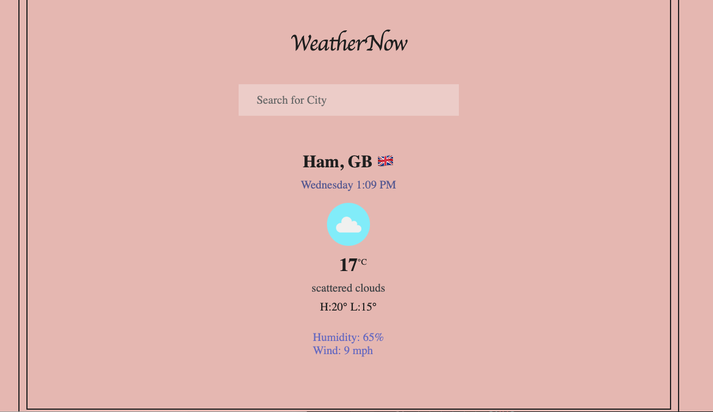

# WeatherNow Application

The WeatherNow application is a simple weather app that allows users to check the current weather conditions in a particular location. The app provides weather details such as temperature, wind speed, humidity, and weather description for the desired location. Users can either search for a specific city or allow the app to access their current location to display the weather information.

## Technologies Used

- HTML
- CSS
- JavaScript

## Features

- Search for weather by city name
- Display weather details including temperature, wind speed, humidity, and weather description
- Automatically retrieve and display weather information based on the user's current location
- Display error messages in case of any issues with retrieving weather data

## APIs Used

The WeatherNow application uses the OpenWeatherMap API to retrieve weather data.

## How to Use

1. Clone the repository to your local machine.
2. Open the `index.html` file in your web browser.
3. Enter a city name in the search bar and click the search button to get the current weather details for that location.
4. Alternatively, you can allow the app to access your current location, and it will automatically display the weather details for your current location.

## Preview

## Credits

This project is based on the guidance and tutorials provided by [OpenWeatherMap](https://openweathermap.org/).

